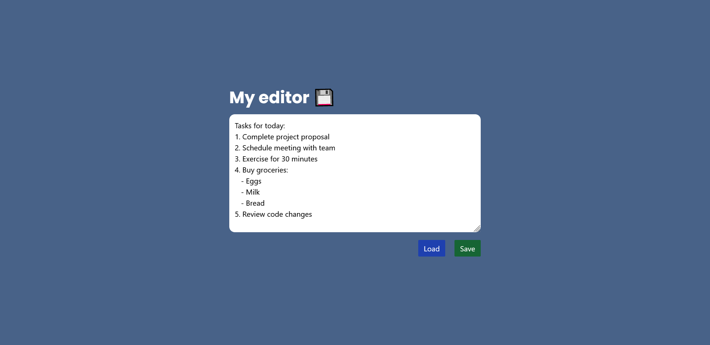

# Simple Note Editor



## Project Description

Simple-editor is a [minimalist website](https://my-simple-editor.netlify.app/) that allows users to save and upload notes. This project was created to make it easier to store simple notes online and to become familiar with localstorage.

## Features

- **Saving notes:** Users can enter text into the editor and save their notes.
- **Loading notes:** Previously saved notes can be loaded by users.

## My process

### Built with

- Semantic HTML5 markup
- CSS - Tailwind
- JavaScript
- [Parcel](https://parceljs.org/) - web bundler

### What I learned

In this project I used tailwind for the first time and stored data in localstorage. I also learned about meta properties. A simple project but satisfying.

## Run Locally

1. Clone the repository to your local machine:

    ```bash
    git clone https://github.com/BartyDash/simple-editor.git
    ```
2. Go to the project directory

3. Install dependencies
    ```bash
    npm install
    ```

4. Start the server
    ```bash
    npm run start
    ```
